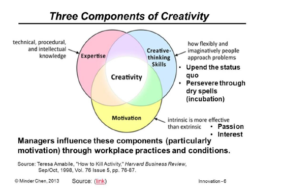

Understanding IT Innovation

# L1: IT Innovations

-   Definition of Innovation:

    -   **Schumpeter: Innovation involves (1) a new idea that is (2) applied commercially**

    -   Fagerberg: Invention is the first occurrence of an idea for a new product or process, while innovation is the first attempt to carry it out into practice.

    -   OECD: Innovation is the implementation of a new or significantly improved product (good or service), process, new marketing method or a new organisational method in business practices, workplace organisation or external relations.
-   Innovation is more than creative ideas -- it's the implementation of those ideas with resources and expertise that make it possible to embody the idea in a useful form (new business / device / process / product).
-   Importance of Innovation:

    -   **Creative disruption - waves that restructure entire industries and markets in favour of those who grasp and adapt to technological changes faster**

    -   Schumpeter: the opening up of new markets\... and the organizational development \... illustrate the same process of industrial mutation, that incessantly \[constantly\] revolutionizes the economic structure from within, incessantly destroying the old one, incessantly creating a new one

    -   innovative cutting-edge firms (and their business models) enter markets and disrupt them forcing less productive models out
-   **IT is an enabling technology** -- it spreads to most sectors, continually improves in usefulness and lowers in cost and spawns innovation in other areas making it easier to develop new products, processes or services. For example, Uber would not exist without the smartphone.
-   Importance of technological innovation:

    -   Importance to a country:

        -   Most important **competitive driver** in many industries

        -   Leads to productivity improvements

        -   Strongly linked to GDP and standards of living, job creation, enjoyment of life, health improvements, education improvements, decreases pollution, improve disaster response

    -   Importance to a company: More likely to...

        -   be profitable

        -   export to other markets

        -   increase **range of goods / services** on offer

        -   increase employment

        -   increase training for employees

        -   increase social contributions such as community enhancements projects

    -   Innovation system:

        -   **innovation system is an open network of organisations that interact with each other and operate within framework conditions that regulate their activities and interactions**

        -   three components of the innovation system -- **networks, innovation activities, framework conditions**

        -   Collectively function to produce and diffuse innovations that have, in aggregate, economic, social and/or environmental value
-   Innovating businesses - includes businesses that introduced at least one type of innovation during the reference period
-   Innovation-active businesses - includes businesses that undertook any innovative activity irrespective of whether the innovation was introduced, still in development or abandoned during the reference period\`
-   **Tutorial 1: Importance of Innovation to a Country **
    -   

# L2: Technological Innovations

-   General purpose technologies:

    -   **General purpose technology differs from other technologies -- it is pervasive (spreads to many sectors), continually improves in use and lowers in cost, and spawns innovation in new areas making it easier to invest and produce new products, processes or services**

    -   GPT describes a new method of producing and inventing has a protracted aggregate impact (e.g. electricity, steam engine, IT)

    -   GPT have the potential to affect the entire economic system and can lead to far-reaching changes (social factors, working hours, family life, etc.)

    -   ICT spreads across many industries (e.g. big data, social, IoT, cloud, AI, etc.)

    -   Examples:

        -   Watson with medical diagnostics

        -   Software in cars (controls, monitoring, self-driving, etc.)

        -   Amazon Go in retail

        -   MOOCs in education (peer assessment, automatic grading, proctoring exams -- someone watches on webcam and monitors exam)
-   **IT innovation as creative destruction:**
    -   **IT has enabled creative destruction** -- 41/500 companies are IT-based -- digital is the main reason over half of companies on the fortune 500 have disappeared

    -   Business being run on software -- businesses build around software (SaaS) -- software innovation is key in many industries

    -   For example:

        -   Bookseller: Amazon \> Borders

        -   Video store: Netflix \> Blockbuster

        -   Music: Apple, Spotify, Pandora \> Sony, etc.

        -   Direct marketing: Google
-   **Types and sources of innovation:**
    -   Different dimensions:

        -   What type of thing is being innovated? -- **product vs process vs business** **model**

        -   How different is it from what's already available? -- **radical vs incremental**

        -   What impact will it have on the consumer? -- **life changing vs incidental**

        -   What impact will it have on the market or industry? -- **disruptive vs sustaining**

        -   What scope of the product/service/process does it affect? -- **architectural vs component**

        -   What impact will the innovation have on the producers? -- **competence enhancing or competence destroying**

    -   Product innovation \[thing being innovated\]:

        -   the development of new products, changes in design of established products, or use of new materials or components in the manufacture of established products

        -   Examples: search algorithm, intra-car communication, etc.

            -   Video games: Atari, Nintendo, PlayStation, VR

            -   Music: Sony Walkman, iPod, smartphone

    -   Process innovation \[thing being innovated\]:

        -   Process innovation - discovery and implementation of a new or improved production or delivery method

        -   Process could be related to production/engineering or related to business processes

        -   Example: personalised surgery (enabled through 3d printing, simulation, imaging, etc.)

    -   Business Model Innovation \[thing being innovated\]:

        -   New and radically new business models (way to make money)

        -   Sharing economy (Uber / Airbnb), freemium (Dropbox), personalised ads (Google), group buying (Groupon), cloud services (AWS)

    -   Radical Innovation \[difference from available solutions\]:

        -   Degree to which it is new and different from existing products and processes.

        -   Example: 3D printer

    -   Incremental Innovation \[difference from available solutions\]:

        -   involve only a minor change from (or adjustment to) existing practices

        -   Example: MS Office updates, new iPhone release

    -   Architectural innovation \[affected solution scope\]:

        -   Entails changing the overall design of the system or the way components interact.

        -   Most architectural innovations also require changes in the underlying components.

        -   Example: cloud computing, sharing economy platforms

    -   Component innovation \[affected solution scope\]:

        -   Changes to one or more components of a product system without significantly affecting the overall design

        -   Examples: changing the algorithm for face detection in a camera for higher performance, smartphone generations.

    -   Competence enhancing \[impact on producers\]:

        -   Innovations build on the firm's existing knowledge base

            -   Intel's Pentium 4 built on the technology for Pentium

    -   Competence-destroying \[impact on producers\]:

        -   Innovations render a firm's existing competencies obsolete

            -   Kodak invented the first digital camera -- but they struggled to make the transition from analogue film to digital photography as most of their competence related to analogue film (rather than micro-electronics)
            -   Depends on the perspective of a particular firm -- digital cameras were not competence-destroying for Sony or Canon as they already had microelectronics expertise.
-   **Tutorial 2: Importance of IT innovation in the Edu**
    -   MOOCs

# L3: Industry Dynamics

-   **Diffusion of Innovations:**
    -   Used to understand, plan and influence the adoption of new products -- "New ideas tend to follow a pattern in entering society".

    -   **Diffusion is the process in which (1) an innovation is (2) communicated through certain channels (3) over time among (4) the members of a (5) social system**

    -   Stages in the innovation development process:

        -   Recognising a need or problem

        -   Basic applied research (scientific research)

        -   Development - putting an idea in a form to meet users' needs

        -   Commercialisation -- production, manufacturing, marketing

        -   Diffusion and adoption -- spreading innovation through member of a social system

        -   Consequences

    -   **Five types of adopters \[Technology Adoption Lifecycle Model - Rogers\]: **

        -   Innovators -- take risks to enter new technology

        -   early adopters -- opinion leaders

        -   early majority -- wait before adopting

        -   late majority -- initially sceptical

        -   laggards -- aversion to change

    -   Difficulty for high-tech products to move into the mainstream -- called crossing the chasm -- if done, greater opportunity for dominance in a market

    -   **Process of innovation adoption \[Innovation Adoption Process - Rogers\]:**

        -   Knowledge

        -   Persuasion

        -   Decision (accept / reject)

        -   Implementation

        -   Confirmation

    -   **Rate of adoption of an innovation \[Innovation Adoption Process - Rogers\]:**

        -   Relative advantage -- extent it is viewed as better than the idea it supersedes

        -   Compatibility -- extent it is perceived as consistent with the existing values, past experiences, and needs of potential adopters

        -   Simplicity (vs Complexity) -- extent it is perceived as simple to understand and use

        -   Trial-ability -- degree it may be experimented with on a limited basis (low cost, "free trial offer")

        -   Observe-ability -- extent to which results of an innovation are visible to others, who imitate

        -   Extent of Change Agents' Promotion Efforts (e.g. marketing)

    -   Innovations do not always diffuse successfully -- e.g. the Dvorak keyboard (better design, significant typing improvement in speed, not wide spread adoption) failed to overtake the QWERTY keyboard.

        -   Why didn't it overtake? Lock-in, standardisation, retraining costs
-   Emergence of new product categories:

    -   Technology: a manner of accomplishing a task especially using technical processes, methods, or knowledge

    -   **Product category:** a product category is all the products offering the same general functionality -- a socially constructed partition of products that are perceived to be similar and in which firms choose to position their products

    -   Factors that lead to a dominant category:

        -   Technical factors

        -   Firms' attempts to claim advantages market positions

        -   Stakeholders making sense of emerging categories
-   Dominant Design:

    -   Design around which the industry settles

    -   Explains and predicts of the dynamics of product and process innovation in the industry

    -   **Concept of a dominate design:**

        -   **Dominant Designs are not specific products, they are architectures**

        -   When a new product is first introduced, it is usually "made-to-order"

        -   If the product attracts significant market share (through whatever path -- technological superiority, good marketing etc.), it forces imitation by competition

        -   Competitive products are released

        -   There is pressure to reduce costs in components leading to commoditisation of components (for mass production)

        -   This requires there to be a "dominant design" with components fitting within this design

        -   **The dominant design may be established by the first company to release a product, a later arrival or by a standards body** (e.g., ISO and IEEE)

        -   The dominant design becomes a base for the whole industry

        -   This design may become a De facto standard or De jure

    -   **Two phases in reaching a dormient design: **

        -   Fluid phase:

            -   Uncertainty about the technology and its market

            -   Firms experiment with different product designs

        -   Specific phase (i.e. innovations are specific to the dominant design):

            -   There is a stable architecture (dominant design) for the technology

            -   Firms focus on incremental innovations to improve components

            -   Firms focus on process innovations to produce them efficiently and effectively

    -   Examples:

        -   IBM PC Architecture

        -   WIMP (window, icon, menu, pointing device)

        -   Internet protocol stack (TCP/IP)

        -   The core web standards (HTML, HTTP, URL)

        -   LAMP (Linux, Apache, MySQL and Perl/PHP/Python)

        -   Relational Database Management Systems

        -   Apple iPhone application architecture -- The Android architecture

    -   The **introduction of a new technology may cause a technological discontinuity in the industry leading to a new cycle** **\[Technology Cycle - Tushman\]** -- this can be either competence enhancing or competence destroying for particular companies

    -   Design dominance and technology cycles:

        -   Era of Ferment

            -   Custom solutions

            -   Experimentation with different product designs

        -   Era of Incremental Change

            -   Increased market penetration -- segment market w/ different models and price

            -   Improved product functionalities (incremental product innovation) -- new features and increased performance

            -   Improved production efficiency (process innovation) -- lower production prices through simplification of components or process innovation.

        -   This continues to the next technological discontinuity

        -   During the era of incremental change firms often:

            -   stopped investing in learning about alternative designs

            -   focused on developing competencies related to the dominant design

            -   The above help explain why firms entrenched in a dominant design often don't recognise or react to discontinuous technologies

    -   **Sometimes standards are used to encourage or maintain a dominant design in an industry**

        -   Standards may be developed due to:

            -   Market forces and industry recognition

            -   Formal standards organisation

        -   Standards may be for controlling:

            -   Quality -- products / services have required characteristics

            -   Compatibility -- can be used with other products / services

                -   Sponsored -- party holds interest in tech

                -   Non-sponsored

    -   Why are dominate designs selected?

        -   Market forces - the more a technology is adopted, the more valuable it becomes because of:

            -   Learning effects -- industry knowledge gained from the product -- can develop it faster and structures culture based on tech

            -   Network effects -- benefits from a large number of users

            -   Government regulations -- sees importance in a technology and regulates a specific dominant design -- strong consumer or economic interests -- e.g. AU change over from analogue to digital TVs

        -   Types of network effects:

            -   Direct network effects: increase in usage leads to direct increase in value -- e.g. Email, Telephone, Twitter

            -   Indirect network effects: increase in usage leads to increase in value of complementary goods leading to increase in value of the original technology --e.g. PC Architecture gained value from value of compatible software

            -   Two-sided network effects: increase in usage by one set of users increases value to another set -- e.g. marketplaces (such as eBay, Airbnb), reader/writer software

            -   Local network effects: -- increase in use of local networks (within a larger network) leads to increase in value -- e.g. Instant Messaging, Facebook

        -   **Dominant designs are selected in a self-reinforcing cycle:**

            -   A technology with a large installed base attracts developers of complementary products

            -   A technology with a wide range of complementary products attracts users

            -   An increase in the number of users is an increased installed base

    -   Dominant design strategy:

        -   First mover: getting into market quickly and hoping that your product becomes the dominant design

        -   Second mover: waiting for the dominant design to be completely established and accepted in the market and then producing 'me-too' product under that standard

            -   Competing on low cost and low price and trying to be better than the competition (little innovation)

        -   Fast second: waiting for the dominant design to begin to emerge and the moving to be part of it (that is, helping to create it)

            -   Established firms with technology to protect. Not in their best interest for new technology to become established, but once it seems likely, try to become leaders in the new market
            -   Timing -- has to be ready to move as any first mover\.... Continue to run its core business and waiting to see whom the first mover will be
-   **Tutorial 3: Dominant Design in the Smartphone Market**
    -   Android

# L4: Disruptive Innovation

-   **Technology Evolution \[Technology Performance S-Curve\]:**

    -   Technology performance s-curve: used to show and predict performance improvement in a technology -- charts performance (speed, functionality, etc.) against effort (investment, refinement, etc.) -- shows performance starts off slowly, then improves rapidly, then plateaus.

    -   Example: Deep learning in computer vision, smartphones and tablets in mobile market.

    -   Types of Evolution (chart performance against time -- draw s-curves):

        -   Creative destruction: fastest substitution -- fastest to adopt (e.g. smartphone)

        -   Robust coexistence: Gradual substitution when both old and new tech coexist (e.g. hybrid cars)

        -   Robust resilience: slowest substitution, tech is adopted but slowly (e.g. electric cars)

        -   Illusion of resilience: very slow adoption of new tech followed by rapid substitution when old tech does not adapt and fade (e.g. digital tvs)

    -   Gartner Hype Cycle:

        -   Uses:

            -   Strategic planning of technology development

            -   Companies considering adoption of a technology

            -   Investors investing in technology

        -   Criticisms:

            -   Not scientific -- based on market opinion

            -   Partly self-fulfilling since it is widely used (people may not adopt tech which does not appear to be mature).

            -   Technologies may already appear in the scope of enlightenment and then disappear.

            -   Doesn't deal well with tech that never succeeds or is quickly suspended.
-   **Disruptive Innovation -- Christensen**:
    -   Few technologies are intrinsically disruptive or sustaining in character

    -   **Business model that the technology enables that creates the disruptive impact**

    -   They create new markets or change the value network in an existing market

    -   Value Network:

        -   Similar concept to "industry value chain" but usually more focused on the whole system rather than for a specific product/service type

        -   Products pass through stages and value is added at each stage

        -   An industry value chain is how value is created and passed on between participants in an industry

        -   Value may be from licensing a technology, selling a product, providing a service, etc

    -   **Results of disruption in a market:**

        -   Change the value network in the market (how value is created and captured)

        -   Change the product categories in the market

        -   Change the type of companies involved in the market

        -   Change the actual companies in the market

        -   Change the business models being used in the market

        -   Change the relationships between companies in the market

        -   Change the power relationships in the market

    -   **Innovators' dilemma:**

        -   Established companies study the needs of their customers

        -   Companies innovate to meet the needs of their customers

        -   Companies focus on their high-end customers to maximise return

        -   Consequence is that this leads to sustaining innovations and miss opportunities in emerging technologies

        -   Examples:

            -   Kodak and the digital camera

            -   Microsoft and their OS

            -   Blockbuster and online movie streaming

    -   **Disruptive innovations disrupt markets -- they create new markets or change the value network in an existing market**

    -   **Sustaining innovations sustain markets -- there is no change to the value network in the market**

    -   Disruptive innovation model

        -   Plots product performance against time

        -   3 lines for markets (upward sloping) -- high, mid, low

        -   2 lines for business -- incumbent and entrant

    -   Types of disruption:

        -   **Low-end disruption: there are customers who do not need the full functionality or performance of products already on the market so cheaper alternatives can take over**
        -   **New-market disruption: there are customers who have needs that were not being addressed by existing products**
        -   Examples: Wikipedia and the encyclopaedia, Netflix and entertainment, AirBnB and accommodation
-   Value Chains/Network
-   **Tutorial 4: Cognitive Services and its Value Chain**

# L5: Distributed Innovation I

-   Value Network -- similar concept to the value network but focuses on the whole system.

    -   Analysing value networks lets you see the relationships between companies, your companies position in the market, look for disruptive innovation opportunities

    -   Christiansen, when disruptors enter in to an existing value network they must adopt their business model to confirm to the existing valued network and therefor fail disruption because they become co-opted.

    -   Disruption performed through

        -   Disintermediation -- cutting out the middle man

        -   Re-intermediation -- adding a new intermediary

        -   Ignoring the current value network and have it change around you.

-   Distributed Innovation:

    -   Traditionally most innovation was done in house, some spreading of innovation through spill overs

    -   Shilling: one-way flow model -- describes many ideas in, few small project, in product all originating from inside the company.

    -   Innovation changed in 20^th^ century with the easy availability of venture capital and better communication technologies

    -   Distributed innovation; Eric von Hippel (1998) -- a system in which innovation emanates not only from the manufacturer of a product but from many sources including users and rivals.

    -   Joy's law -- most of the bright people don't work for you \-- no matter who you are. So, you need a strategy that allows for innovation occurring elsewhere

    -   Open innovation - distributed innovation process based on purposively managed knowledge flows across organizational boundaries, using pecuniary and non-pecuniary mechanisms in line with the organization's business model

    -   Open innovation brings ideas that originate outside the organisation into the organisation

    -   Types of open innovation:

        -   Outside in -- enrich companies own knowledge by integrating external ideas

        -   Inside-out -- earn profits by bringing ideas to market, selling IP, and multiplying technology by transferring ideas to the outside market

        -   Coupled process -- cocreation with mainly complementary partners through alliances, cooperation, and joint ventures.

    -   Benefits of open innovation:

        -   Larger base of ideas

        -   Can use existing third-party technology

        -   Identification of new business opportunities

        -   Share risks and pool resources

    -   Risks of open innovation:

        -   Lack of control -- limited use with external resources

        -   Need to manage external relationships

        -   Higher coordination costs

        -   Possible loss of internal capabilities

        -   Possible loss of competitive advantage

    -   Enablers of distributed innovation:

        -   Modularity -- use of individual distinct functional units / divide into smaller modules. Products can be modular at:

            -   User level -- Firefox addons, Office plugins

            -   Producer (company) level -- software based on a company's platform

            -   Industry -- each component of a PC made by different companies

-   Product platforms -- foundation of components around a family of related products (can use different price points, different customer types).

    -   Companies can provide product platforms by:

        -   Making source code available e.g. Java

        -   Provide toolkit e.g. SAP, XML toolkit for java

        -   Provide plugin / addon support e.g. Google extensions

        -   Provide a product platform for external innovation e.g. Android

        -   Provide live data / functionality via API e.g. Facebook

    -   Benefits:

        -   Can be made available externally =\> new business models

        -   Faster development time

        -   Higher adaptability

        -   Innovative aspects of a platform can benefit a range of products

-   Web APIs

    -   Interface for web-based services to interact

    -   Enable modularity on the web

    -   Used for payments, maps, messaging

    -   In the API economy companies that prosper are the ones that aggregate the most data smartly and open it up to others

    -   API business models:

        -   API as a product -- has specific money-making goal or servers as a single source of income for the company.

        -   API enhancing existing product -- majority of APIs; main money making activates associated with different products; more business models such as direct pay-to-play to indirect, commission-based

        -   API promoting existing product -- designed to solidify market position; often free and work to attract interest and traffic

    -   API businesses: Salesforce (50% of revenue), Expedia (90% of revenue), eBay (60% of revenue).

-   Crowdsourcing:

    -   Crowdsourcing represents the act of a company or institution taking a function once performed by employees and outsourcing it to an undefined (and generally large) network of people in the form of an open call
    -   Elements: clear goal, defined crowd, crowd sourcer is identified, online processes, uses internet, open call of variable extent
    -   Why do people do it?

        -   Desire to earn money

        -   Develop skills

        -   Networking

        -   Build portfolio

        -   Socialise

        -   Have fun
    -   Crowdfunding is the sourcing of funds from a crowd -- a specific type of crowdsourcing
-   **Tutorial 5: Distributed Innovation**

# L6: Distributed Innovation II

-   Open data - data and content that can be freely used, modified, and shared by anyone for any purpose

    -   Many governments have opened up data:

        -   Census (tables if static data)

        -   Live data feeds (RSS or data service)

        -   AU government -- electoral boundaries

        -   NSW government -- bus stop data, electricity consumption

    -   Companies are offering open data

        -   GoGet car share data

        -   Coca Cola Amatil data

    -   Value of open data:

        -   Economic -- increased efficiency, new products and services, consumer surplus (cost savings, convenience, better products)

        -   Big data replaces or supports the human decision-making process

        -   Opens up new business opportunities

        -   Governments play a key role

    -   Benefits are self-reinforcing

    -   Kaggle -- allowing companies to open data to solve company-specific problems
-   Free and Open source

    -   Traditionally most software was proprietary

    -   Free an open source software makes source code available, allows source code to be changed and redistributed

    -   Example:

        -   Linux -- operating system; wrote kernel with community involvement

    -   Free software -- users' freedom to run, copy, distribute, study, change and improve the software -- 4 freedoms:

        -   Run program for any purpose

        -   Can study how program works

        -   Redistribute copies

        -   Distribute modified copies

    -   Copyleft -- general method for making a program work free, requiring all modified and external versions to be free as well.

    -   Open source software movement -- focus on providing access to source code rather than rights to users

    -   Open Source Initiative definition:

        -   Freely redistributable

        -   Source code available for free or reasonable cost

        -   Modifications allowed

        -   Protect integrity of authors source code

        -   No discrimination against people or fields

        -   Must not restrict use / favour specific product

        -   Must be technology neutral

    -   FOSS (Free and Open Source Software); or FLOSS (Free/Libre and Open Source Software) -- one lets you keep changes private one needs it to be made available.

    -   Difference between FSS and OSS:

        -   Open source covers many licence types

        -   More ability to mix with proprietary software

        -   Developed to bring major business into the mix

        -   OSS and copyleft -- changes to the source code must be available to others

        -   OSS and not copyleft -- changes to the source do not need to be made available to other

    -   Many companies use open source software

        -   Most R&D in start-ups uses FOSS -- internal IT infrastructure, building and running web services, etc.

        -   Open source allows companies to rapidly innovate their infrastructure and services.

        -   Most new software is built using FOSS -- platforms (aka. Programming languages), software libraries, build and test automation

        -   Most new software contains FOSS -- reduce development time, reduce testing and maintenance costs, provide compatibility with other software.

        -   Open source business models:

            -   Sell support and services -- canonical with ubuntu

            -   Sell certified version -- cloudera with Hadoop

            -   Enterprise edition -- with MySQL

    -   Challenges when using FOSS

        -   Meeting obligations and software licences -- ensuring appropriate notices

        -   Accidently contaminating code by introducing General Public Licence code =\> legally required to release proprietary code.
-   FOSS Licences

    -   Obligations depend on the actual software licence
    -   Obligations may include: nothing, mention you have used it, redistribute changes you have made to it, not suing other companies in relation to patents you may hold relating to features of the open source project.
    -   Main open source licences:

        -   Permissive licences -- changes don't need to be made available (Public domain, MIT, BSD, Apache Software Licence)

        -   Restrictive (copyleft) licences -- changes must be made available (GPLv2, GPLv3, AGPL, SleepyCat)
    -   Public domain -- no IP rights
    -   MIT -- user can do anything, copyright of original author is maintained, no warranty
    -   BSD -- like MIT but use must be acknowledged
    -   GPL -- more restrictive, must release modified code
-   **Tutorial 6: Open Innovation with Maps**

# **Tutorial 7: Selected Examples of Sharing Economy**

# L8: Distributed Innovation III

-   User Innovation

    -   Traditional model of innovation -- producer makes products / services for customers; assumption that company can invest more in innovation then a single user

    -   User innovation -- idea that users and consumers can be more innovative then the company

        -   When needs are not met by company's products consumers can change it to fit their needs.

        -   These ideas also lead to new companies being formed -- especially in IT

        -   Examples:

            -   WWW -- created by scientific research agency

            -   Firefox addons

            -   Apache web server -- web server based on httpd web server

            -   MySQL -- new relational database developed to better suite needs

            -   Yammer -- private message board productivity tool for Geni; now a private social network

    -   Typical users -- typical in market research, not effective for innovation in IT and high-tech since they suffer from functional fixedness

        -   Lead users are needed for innovation

        -   Lead users realise a need before the general market

        -   Are at the leading edge of trends, hence knowledgeable about state-of-the-art

        -   Lead users are often not a company's lead customers -- they are usually not satisfied with current products, so they create their own.

        -   Sometimes lead users innovate themselves

    -   Perspectives on user lead innovation

        -   Users insights can't predict future demand

        -   User centred processes stifle creativity

        -   User focus makes companies miss out on disruptive innovations

        -   User-led innovation leads to sameness

    -   Maker movement -- group of users coming together from a cross-section of society to collaborate and develop products for their needs.

-   Platform Ecosystem

    -   Well-functioning platforms have:

        -   A governance structure -- set of protocols that determine who can participate and roles they might play and how to interact

        -   Additional protocols to facilitate connection, coordination, and collaboration.

    -   Provide layers of functionality and capabilities that users can interact with

    -   Platform businesses bring together producers and consumers in high-value exchanges.

    -   Example: iPhone, apple imagined phone as more than a device -- it was a way to connect participates in a two-sided market -- App developers on one side and app users on the other -- generating value for both groups.

    -   Incorporates: network effects, self-reinforcing cycle, modularity, product platforms

    -   Platform businesses bring together producers and consumers in high value exchanges

    -   Chief assets are information and interactions which together are also the source of the value they create and their competitive advantage

    -   Roles in a platform ecosystem

        -   Producers create the platforms offering

        -   Consumers buy or use the platforms offerings

        -   Platform providers provide the interface to the platform

        -   Platform owners own the platform IP and controls who participates and how

    -   Pipelines vs platforms:

        -   Companies that take in resources, add value, and release a higher value product

        -   Companies create value by controlling the interactions between producers and consumers

    -   Strategies:

        -   Resource control to resource automation

        -   Internal optimisation to external interactions

        -   Focus on consumer value to focus on ecosystem value

    -   Measuring a platform business:

        -   Interaction failure

        -   Engagement

        -   Match quality

        -   Negative network effects

    -   Types of platform businesses:

        -   Integrator platform -- connect people via platform

        -   Product platform -- provide foundation for people to build upon

        -   Two-sided platform -- facilitate collaboration between external parties

    -   Types of platforms

        -   Aggregation -- Facilitate transactions, connect users to resources, hub and spoke model -- eBay, Airbnb, App Store
        -   Social -- facilitate social integrations, network model -- Facebook, twitter
        -   Mobilisation -- move people to act -- apache or Linux
-   **Tutorial 7: BMC**

# L10 IT Innovation management; Judging Innovation

- Key principles for start-up

    -   Customer developwment

        -   "get out of the building"

        -   Including hypothesis -- driven experiments with customers, pivoting etc

    -   Business Model Canvas

        -   "Sketch Out your Hypotheses"

    -   Agile software development

        -   "Quick, Responsive Development"

- Managing Projects for innovation

    -   Background

        -   In innovation projects, there are many unknowns:

            -   Feasibility of idea may be unknown

            -   Product or process concept may be vague

            -   Target customers may be unknown

            -   The way to make revenue may be unknown

        -   Some companies attempt to use traditional project management approaches for innovation projects

            -   This often fails

    -   Traditional Model

        -   Concept/seed product development Alpha/Beta test Launch

        -   Problems

            -   Impossible to know all requirements in advance

                -   The project takes time so the requirements at the time of capture may be different from those at the time of delivery

                -   Some requirements are only clear when users are using the product

                -   Too long to get customer validation of product

            -   Doesn't fit to the customer development process

    -   The Agile Manifesto

        -   Values:

            -   Individuals and interactions over processes and tools

            -   Working software over comprehensive documentation

            -   Customer collaboration over contract negotiation

            -   Responding to change over following a plan

        -   **User Stories:** in consultation with the customer or product owner, the team divides up the work to be done into functional increments called "user stories" each user story is expected to yield a contribution to the value of the overall product

        -   **Daily meeting:** each day at the same time, the team meets so as to bring everyone up to date on the information that is vital for coordination: each team members briefly describes any "completed" contributions and any obstacles that stand in their way

        -   **Incremental development:** nearly all agile teams favour an incremental development strategy; ensure each successive version of the product is usable, and each builds upon the previous version by adding user-visible functionality

        -   **Iterative development:** agile projects are iterative insofar as they intentionally allow for "repeating" software development activities, and for potentially "revisiting" the same work products

        -   **Team:** a "team" in the agile sense is a small group of people, assigned to the same project or effort, nearly all of them on a full-time basis.

        -   **Milestone Retrospective:** once a project has been underway of some time, or at the end of the project, all of team's permanent members invests from one to three days in a detailed analysis of the projects significant events

        -   **Personas:** when the project calls for it -- for instance when user experience is a major factor in project outcomes -- the team crafts detailed, synthetic biographies of fictitious users of the future product: these are call "personas"

    - Common agile methodologies:

        

- The Lean Startup

    -   Eric Ries

        -   Learn Faster

        -   Code Faster

        -   Measure Faster

    -   Minimum Viable Product (MVP)

        -   Entrepreneurs are everywhere

        -   Entrepreneurship is management

        -   Validated learning

        -   Innovation accounting

        -   Build-measure-learn

    -   Product Market Fit

        -   Being in a good market with a product that can satisfy that market

        -   For lean product process

            -   Test your MVP with customers

            -   Create your MVP prototype

            -   Specify your MVP feature set

            -   Define your value proposition

            -   Identify underserved customer needs

            -   Determine your target customer

    -   Reasons of Startup Failure

        -   No market need

        -   Ran out of cash

        -   Not the right team

        -   Get outcompeted

        -   Pricing / cost issues

- Judging IT Innovation (Criteria)

    -   CES 2018

        -   Logitech Flow: Multi-OS device connectivity

        -   HP Z 3D Camera: 3D scanning

        -   Turnoutt: Map with social engagement

    -   Judging panel

        -   Industry experts

        -   Business executives

        -   Academics

    -   Typical Judging Criteria

        -   Technology

        -   Design

        -   Innovation

        -   Feasibility

        -   Concept

    -   CES Criteria

        -   Engineering qualities

        -   Aesthetic and design qualities

        -   Product use/function and user value

        -   Innovation

        -   Market potential

    -   Berkeley big ideas

        -   **Pre-proposal** round focuses on the extent to which the teams propose a creative solution to a social problem and the project's intended social impact

        -   **Full proposals** are judged primarily on the project's potential social impact and the viability of the project plans

    -   ImagineCup Microsoft

        -   Technology

        -   Innovation

        -   Concept

        -   Feasibility

    -   i3 Judging Criteria

        -   Impact

        -   Team

        -   Plan

#L11 Organizational Culture; Structures Supporting Innovation

- Organizational Culture: “Scientific Management” (Taylorism)

  - Standardize work into separate tasks
  - scientifically study each task
  - Continually measure performance of task
  - compensate workers based on performance

- influence of Taylorism in organization

  - scientific management used not just in factories, but in most organization
  - Gantt Charts
  - using budgets for accountability and performance measurement
  - key performance indicators, linked to incentives

- creating a culture for generation of new ideas

  - **Liquid Network:** having a diversity of expertise, and it’s ideas bouncing between different expertise that so often triggers the big breakthrough
  - **Slow Hunch**: a great idea slowly fades into view over a long period of time
  - **Connecting vs Protecting:** interaction leads to the overall best result, keeping an idea to oneself leads to thought stagnation, because our experiences and genetic makeup usually take us down the same thought path repeatedly

- Structure Supporting Innovation

  - Organizational Culture: Motivation (Pink)

    - True motivation does not come from traditional incentives
    - Comes from:
      - Autonomy
      - Mastery
      - Purpose

  - Culture for creativity

    

    - factor that most led to engagement of workers was:
      - “Making progress in meaningful work”
      - more important than bonuses, raises, etc.
      - more likely to lead to ideas/breakthrough

  - The dynamics of “Inner Work Life”

    - **Emotions:**
      - sharply-defined reactions and more general feeling
      - Joy, disappointment, pride
    - **Perceptions:**
      - From immediate impressions to theories of what is happening
    - **Motivations:**
      - Extrinsic motivations
      - Intrinsic motivations more important than extrinsic for creativity
      - Relationship or altruistic motivation

  - Innovation openness

    - companies to engage in external relationships for innovation
    - Features:
      - Risk feature
      - Belief feature
      - Exchange and share feature
      - Governance feature
      - Partner feature
      - Training feature

- Culture and Innovation in a Digital Age

  - the only thing that’s going to enable you to keep building new capabilities and trying out new concepts long before they are conventional wisdom is culture
  - Culture for a Digital age
    - cultural obstacles correlate clearly with negative economic performance
    - culture is the most significant self-reported barrier to digital effectiveness
  - Cultural intervention points
    - An appetite for risk: people feel comfortable trying things that might fail
    - Making bold bets
      - A culture of digital aspirations
      - Embracing resource reallocation
    - A customer-centric organizational culture
      - data and tools
      - unifying force
    - Busting silos
      - Data-driven transparency; Digital information breakdowns
    - Instilling accountability

- Company Structure supporting invention and innovation

  - Size and structural dimensions of companies
    - Large companies might be disadvantaged for innovation:
      - R&D efficiency may decrease due to loss of managerial control
      - More bureaucratic inertia
      - More commitments tie companies to current tech: learning effects
    - Small firms are flexible and entrepreneurial
      - change direction quickly by on changing circumstances
    - Big companies “feeling small”
      - break overall company into several subunits
      - utilize different culture and controls in different units

- Structural dimensions which influence innovation

  - **formalization**: rules and procedures to structure the behavior of employees
  - **standardization**: company activities are performed in a uniform manner
  - **centralization**
    - Centralized authority
    - Centralized activities

- **Mechanistic Structure vs Organic structure**

  - **Mechanistic Structure** have high formalization and standardization
    - good for operational efficiency, reliability
    - minimizes variation
  -  **Organic structure** have low formalization and standardization
    - encourage creativity and experimentation
    - low consistency and reliability

- Combining the best of small and large

  - some divisions may be small and organic
  - other may be larger and more mechanistic
  - some try to do both in different divisions

- **Case Study:** Successful Culture for Innovation

  - Lockheed Martin Skunk works

    - developing disruptive solutions to ensure advantage
    - Small empowered teams, streamlined processes and the culture that values the lessons learned when you are bold enough to attempt sth that hasn’t been done before
  - Kelly’s 14 rules & practices
  - Apple - One organization, different cultures
    - corporate structure wasn’t appropriate for the new products:
      - Structured for sound and efficient manufacuring
      - wanted new group to have different culture and more flexibility
    - Jobs started new product development group to develop Macintosh with **renegade culture**
    - he hijacked a team working on another project 
  - Google: keeping benefits of a small company in a large company
    - “20% time”: working on what they think will most benefit Google
    - **“Solve for X” – a Moonshot factory:** 
      - **we looking for the intersection of a big problem, a radical solution, and breakthrough technology**
      - **we tackle ideas that have the riskiness and ambition of early-stage research and approach them with the focus and speed of a startup**
      - **X is a team of inventors and entrepreneurs from a wide variety of backgrounds**

#L12 Innovation Ecosystem; Sydney's Innovation Ecosystem

- The innovation ecosystem
  - Open network of organisation that interact with each other and operate within framework conditions that regulate their activities and interactions
  - There components
    - Innovation activities
    - networks
    - Framework conditions
  - Collectively function to produce and diffuse innovations that have, in aggregate, economic, social and/or environmental value

- **Case study**
  - Silicon Valley 
    - Tech company density
    - Importance during phases of IT innovation history
  - Factors that led to the emergence of Silicon Valley as a powerful tech ecosystem
  - Successful innovation ecosystem
    - Strong research-driven universities
    - Globally experienced repeat entrepreneurs
      - Elon Musk
    - Sophisticated risk capital
      - Nasdaq
    - Social captial
    - Knowledge sharing 
    - Tolerance for risk taking
    - Creative destruction
    - Constructive failure
    - Positive aggregate returns
    - Supportive government policy
- Sydney's Ecosystem
  - Co-working spaces
  - Accelerators
  - Tech business incubators
  - Government programs: R&D Tax Incentives
  - Universities 
  - Government-funded research organization: CSIRO (Data61)
  - Established companies doing software/hardware development: Atlassian, Google, Canon
  - Hacker spaces

#L13 Review

- Level of Involvement
  - Society,Country and World
  - Organization
  - Individual or team
- Technology innovation
  - Innovation = Idea + Application
  - Innovation as creative destruction
  - Importance of Innovation
    - Competitive driver in many industries
    - Leads to improvement in productivity
    - Linked with improvements in GDP
    - Linked to improvement in standard of living 
    - High growth firms
- Innovation cycle

